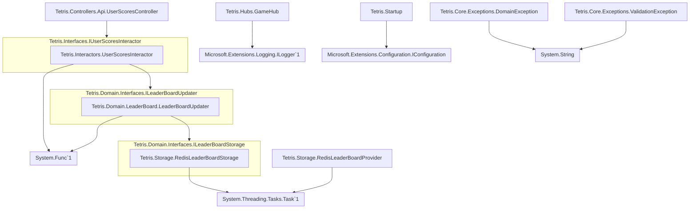

Example output from running the program on the bin of the Tetris game:

```mermaid
flowchart TD
  Tetris.Core.Exceptions.DomainException --> System.String
  Tetris.Core.Exceptions.ValidationException --> System.String
  Tetris.Storage.RedisLeaderBoardProvider --> System.Threading.Tasks.Task`1
  Tetris.Storage.RedisLeaderBoardStorage --> System.Threading.Tasks.Task`1
  Tetris.Domain.LeaderBoard.LeaderBoardUpdater --> Tetris.Domain.Interfaces.ILeaderBoardStorage
  Tetris.Domain.LeaderBoard.LeaderBoardUpdater --> System.Func`1
  Tetris.Startup --> Microsoft.Extensions.Configuration.IConfiguration
  Tetris.Interactors.UserScoresInteractor --> Tetris.Domain.Interfaces.ILeaderBoardUpdater
  Tetris.Interactors.UserScoresInteractor --> System.Func`1
  Tetris.Hubs.GameHub --> Microsoft.Extensions.Logging.ILogger`1
  Tetris.Controllers.Api.UserScoresController --> Tetris.Interfaces.IUserScoresInteractor

    subgraph System.String
        
    end
    

    subgraph System.Threading.Tasks.Task`1
        
    end
    

    subgraph Tetris.Domain.Interfaces.ILeaderBoardStorage
        Tetris.Storage.RedisLeaderBoardStorage
    end
    

    subgraph System.Func`1
        
    end
    

    subgraph Microsoft.Extensions.Configuration.IConfiguration
        
    end
    

    subgraph Tetris.Domain.Interfaces.ILeaderBoardUpdater
        Tetris.Domain.LeaderBoard.LeaderBoardUpdater
    end
    

    subgraph Microsoft.Extensions.Logging.ILogger`1
        
    end
    

    subgraph Tetris.Interfaces.IUserScoresInteractor
        Tetris.Interactors.UserScoresInteractor
    end
    
```